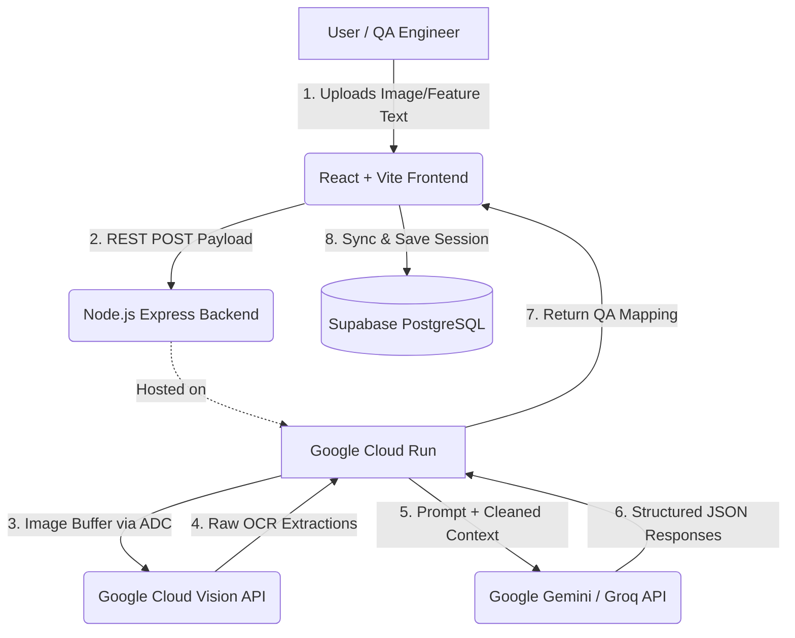

# 🧪 TestGen AI

## 📋 Project Documentation Template

| Section | Details |
|---------|---------|
| **Project Title** | **TestGen AI** - An AI-powered QA Automation Platform |
| **Problem Statement** | In Maharashtra's rapidly scaling IT and tech startup hubs (like Pune, Mumbai, and Nagpur), software development teams face immense pressure to ship products fast. Traditional manual QA and test case writing is a severe bottleneck, leading to delayed deployments and escaped bugs. **TestGen AI** solves this by automating rigorous QA processes directly from feature descriptions or UI screenshots, allowing Maharashtra's local startups and enterprises to accelerate their delivery cycles and maintain high software quality with limited QA resources. |
| **AI Component** | • **Google Cloud Vision API:** Used for advanced Optical Character Recognition (OCR) to extract text and spatial structure from application screenshots.<br>• **Google Gemini 1.5 Pro / Flash & Groq LLMs:** Used for deep reasoning, translating visual data and text features into highly structured JSON test sets and executable Java automation code. |
| **Architecture Diagram** | *(See diagram below)* A full-stack flow from the React frontend to a stateless Node.js backend hosted on Google Cloud Run, leveraging GCP robust AI SDKs. |
| **Deployment URL** | **Frontend (Vercel):** [https://ai-testcase-generator-nullpointer.vercel.app/](https://ai-testcase-generator-nullpointer.vercel.app/)<br>**Backend (Cloud Run):** [https://ai-testgen-backend-344488861801.asia-south1.run.app](https://ai-testgen-backend-344488861801.asia-south1.run.app) |
| **Implementation Details** | The **Google Cloud Vision API** was integrated securely using the `@google-cloud/vision` Node SDK utilizing Application Default Credentials (ADC) on **Google Cloud Run**. When a user uploads a UI screenshot, the backend instantly OCRs the image. The messy raw text is then piped through a regex-cleaner and fed into an LLM pipeline engineered to identify UI structures (buttons, inputs) and output purely structured JSON test cases. |
| **GIT Hub** | **Repository URL:** [https://github.com/aditya-codes-git/ai-testcase-generator.git](https://github.com/aditya-codes-git/ai-testcase-generator.git) |

---

## 🏛 Architecture Diagram



---

## ✨ Features

- **Text-to-Test Cases:** Input a raw feature description and receive a highly structured JSON mapping of Test Cases (Positive, Negative, Boundary conditions).
- **Vision AI Processing:** Upload a screenshot of your UI. The backend uses Google Cloud Vision OCR paired with an LLM to automatically deduce testing scenarios.
- **Chat Revision:** Missing edge cases? Interactively chat with the QA-AI to instantly refine the existing list without starting from scratch.
- **Selenium Automation Generator:** One-click conversion of human-readable test steps into a fully structured Java Selenium using the TestNG framework.
- **Excel Export:** Download test cases instantly into an `.xlsx` QA template for import into tools like Jira or TestRail.
- **Cinematic UI/UX:** A stunning, ultra-modern glassmorphic interface powered by Framer Motion, GSAP, and TailwindCSS.

## 🏗️ Technical Stack

### Frontend
* **Core:** React 19, Vite, TypeScript
* **Styling & Animation:** Tailwind CSS, Framer Motion, GSAP, Three.js shaders.
* **State & Data:** Custom hooks, File-saver, ExcelJS.
* **Auth & Database:** Supabase

### Backend
* **Server:** Node.js, Express, Cors, Multer (in-memory parsing)
* **Generative AI:** Google Gemini, Groq API (`llama-3.3-70b-versatile`)
* **Computer Vision:** Google Vision API (`@google-cloud/vision`).
* **Deployment Context:** Designed for **Google Cloud Run** using Application Default Credentials (ADC).

---

## 🚀 Local Setup Guide

### Prerequisites
- Node.js (v18+)
- Supabase Project (for User Authentication)
- Google Cloud Project (with Vision API enabled)
- Groq / Gemini API Keys

### 1. Clone & Install

```bash
git clone https://github.com/aditya-codes-git/ai-testcase-generator.git
cd ai-testcase-generator/ai-testgen
```

### 2. Configure Environment Variables

**Frontend (`/.env`)**
Create an `.env` file in the root `ai-testgen` folder for Vite:
```ini
VITE_SUPABASE_URL=https://<your_supabase_project>.supabase.co
VITE_SUPABASE_ANON_KEY=<your_supabase_anon_key>
VITE_API_URL=http://localhost:8080 # Backend URL
```

**Backend (`/backend/.env`)**
Create an `.env` file in the `backend` folder:
```ini
PORT=8080
GROQ_API_KEY=<your_groq_api_key>
GEMINI_API_KEY=<your_gemini_key>
```
*Note: For local development with Vision API, authenticate via `gcloud auth application-default login`.*

### 3. Run Servers

**Terminal 1: Start Backend**
```bash
cd backend
npm install
npm run dev
```

**Terminal 2: Start Frontend**
```bash
# From the ai-testgen root
npm install
npm run dev
```

---

## ☁️ Production Deployment on GCP

### Backend (Google Cloud Run)
The backend is completely stateless, making it perfect for Cloud Run. 
1. Build horizontally scalable containers.
2. Set `GROQ_API_KEY` and `GEMINI_API_KEY` in the Cloud Run Environment Variables dashboard.
3. Attach a native Service Account to the Cloud Run instance that possesses the **"Cloud Vision API User"** IAM role. 

### Frontend (Vercel)
1. Set the build command to `npm run build` using the Vercel dashboard.
2. Setup the `VITE_` Environment variables.
3. Overwrite the `VITE_API_URL` to point to the live `*.run.app` Cloud Run backend endpoint.

---
*Built with ❤️ in Maharashtra for high-performance QA teams.*
